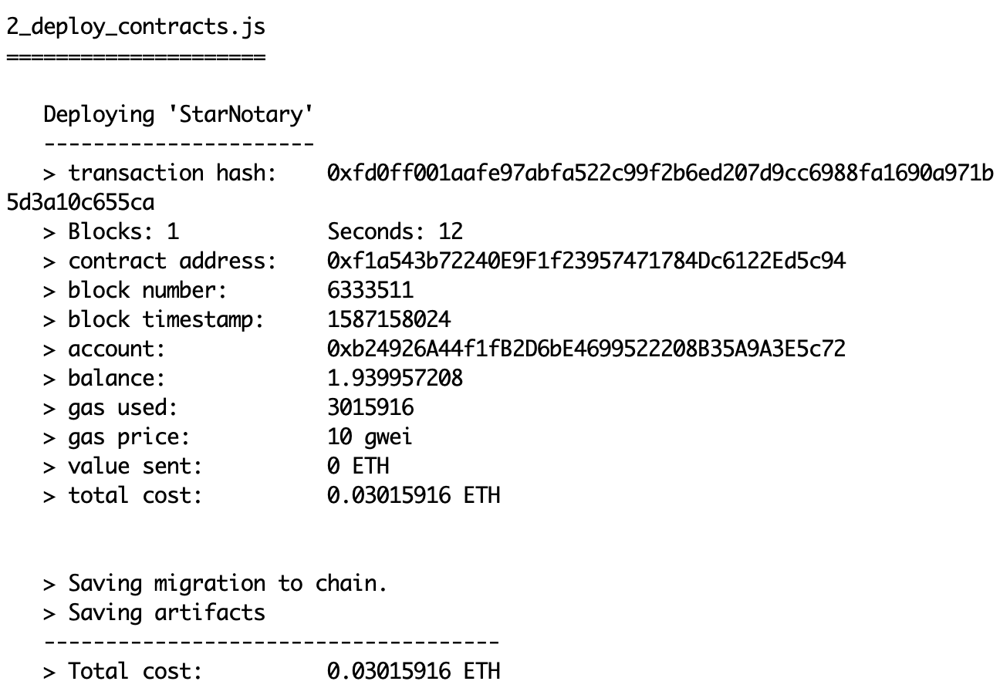
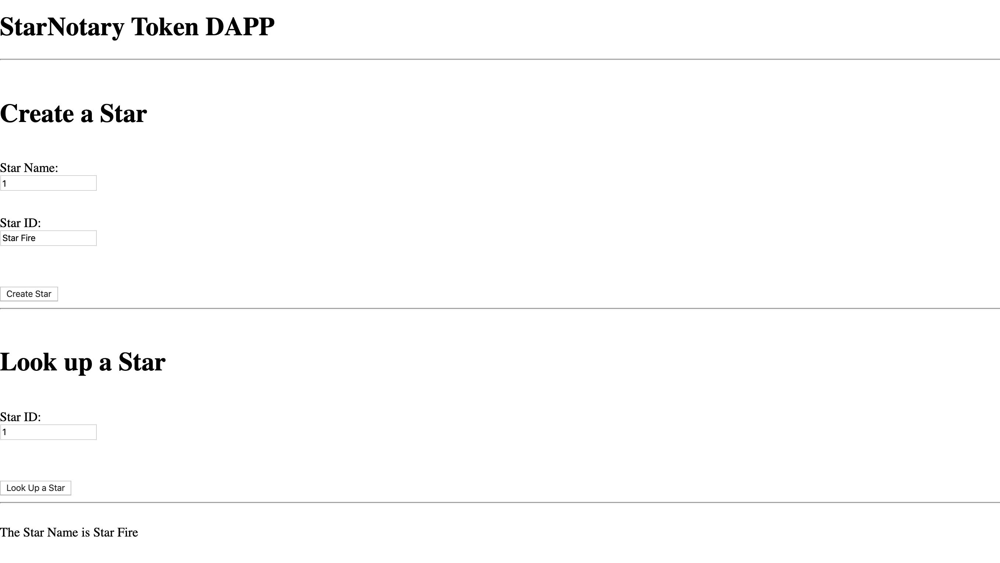
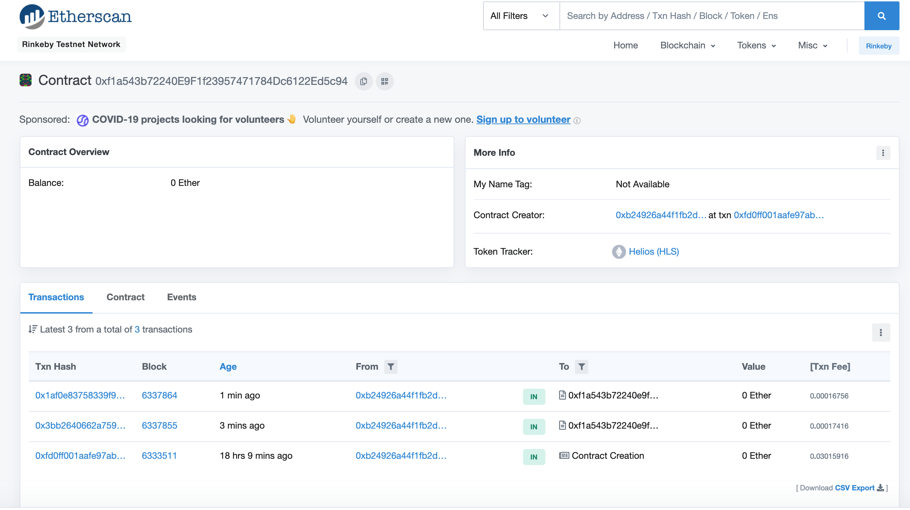

## Build Your Own CryptoStar Dapp

In this project, we use the ERC721 Standard to create a dapp that allows users to create and exchange Stars. I build upon Openzeppelin's ERC721 interface to write the functions that create, sell, buy, and transfer stars. Then, I created a browser UI that allows a user with a Metamask wallet and address to create and send their own stars to Ethereum's Rinkeby Test Network.

<br>

### Installation
In order to follow this project as I have it, you can first clone this repository to your local machine and move into it. Then, you will need to have the following modules. First, you need `Truffle`, which is a development environment to compile, test, and deploy smart contracts. You can then install `Truffle` by using this command in the terminal:

`npm install -g truffle`

The version of Truffle used for this project is `Truffle v5.1.20`.
The next step is to install `Openzeppelin` and `Truffle HDWallet Provider`. Openzeppelin contains many standard ERC interfaces and their implementations. We will be building off of what they provide, rather than writing those implementations from scratch. Truffle HDWallet Provider is a Web3 provider that we will use to connect our wallet with an Ethereum test network.

To install Openzeppelin, make sure you are in your project directory and use this command:

`npm install --save openzeppelin-solidity`
The current version of Openzeppelin I have is `v2.3.0`.

To install Truffle HDWallet Provider, use this command:

`npm install --save truffle-hdwallet-provider`

This will create a `node-modules` folder in your main project folder. The modules you just installed will reside in that folder. If you want to have the same directory structure as I have, then you should move `node-modules` into the `app` folder. If you want to leave `node-modules` where it is, then you just have to update the import statements in the `StarNotary.sol` file at lines 3 and 4, and the `truffle-config.js` file at line 25. All you are changing is updating the path to the modules you installed.

The last step is to setup your Metamask wallet (https://metamask.io/)
and your Infura account (https://infura.io/). Note for Metamask, this wallet app may only be available as an extension on Firefox, Chrome, or the Brave browser. Once you set it up, make sure to copy your 12 word seed phrase, also known as a mnemonic. You will need this for the `truffle-config.js` file. Once you setup an Infura account, you can create a project and check under the project Settings for the project ID and endpoints. Make sure that you select the `Rinkeby` network and copy the information into the `truffle-config.js` file.

If you completed these steps, then you should be able to follow the project in the same way that I have.

<br>

### The StarNotary
The StarNotary contract creates a non-fungible token that represents Stars that people can own, sell, purchase, or exchange. It uses Openzeppelin's implementation of the ERC721 interface. The various methods of token creation, naming, and exchange all build off of Openzeppelin's existing implementation in their token contracts. For example, Openzeppelin implements a contract called `ERC721Full.sol` which my contract inherits. I use the inherited constructor to give my token a name and symbol. They are:

```
Name: Helios
Symbol: HLS
```

Now we want to deploy the smart contract to the Rinkeby Test Network. First, open Metamask, sign in, and then connect to the Rinkby Test Network. Make sure you have at least one address in your account. Then, you will need to type `truffle compile` and `truffle migrate --reset --network rinkeby` in the command line. If this is successful, then the terminal will display the contract address, as shown here:



In order to interact with the smart contract, move into the `app` folder and then use this command:

`npm run dev`

This will create a local webserver and you will be able to access the contract UI at this url: `http://localhost:8080/`

This is the default URL, so yours may be different if you changed any configuration files.

The app shows a simpler UI where you create a star and then use the LookUp function to get its name:



The transaction will occur under the first address you have in your Metamask wallet. Go back to the terminal to find the contract address and go to etherscan.io.
Change the network to Rinkeby and then search for the contract address in the search bar. You should see a page for the contract showing your address as the token creator, the token name and symbol, and also any transactions that occurred.




